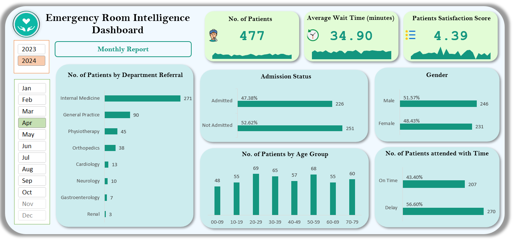

# 🏥 Emergency Room Intelligence Dashboard


An interactive **Excel dashboard** to analyze Emergency Room (ER) operations and support hospital decision-making using **Power Query**, **Power Pivot**, and **DAX**.

---

## 🎯 Project Purpose
To create a data-driven **Emergency Room Intelligence Dashboard** that improves patient management efficiency and delivers actionable insights for hospital stakeholders. The dashboard helps analyze ER performance metrics, detect bottlenecks, and track service quality over time.

---

## 🛠 Tools & Technologies
- ✅ Microsoft Excel (with Power Query & Power Pivot)
- ✅ Pivot Tables & Pivot Charts
- ✅ DAX (Data Analysis Expressions)
- ✅ Calendar Table for time intelligence
- ✅ Custom Healthcare-themed Color Palette

---

## 📊 Key KPIs
| KPI | Description |
|-----|-------------|
| **Number of Patients** | Total patients per day with area sparkline to spot peak activity |
| **Average Wait Time** | Average daily patient wait time; highlights operational delays |
| **Patient Satisfaction Score** | Tracks daily average satisfaction to monitor service quality |

---

## 📈 Additional Visuals
- Patient Admission Status (Admitted vs Not Admitted)
- Patient Age Distribution (10-year age bands)
- Timeliness (% seen within 30 mins)
- Gender Analysis (Male vs Female)
- Department Referrals (Top referred departments)

---

## 🔗 Data Model
**Tables:**
- `Calendar`: Dynamic date table (generated with Power Query)
- `Emergency Room Data`: Main patient data (Patient ID, Date, Department, etc.)

**Relationship:**
- `Calendar[Date]` → `Emergency Room Data[Patient Admission Date]`

---

## 🧮 DAX Calculated Columns

### 🧓 Age Group
```dax
= FORMAT(
    INT('Emergency Room Data'[Patient Age] / 10) * 10,
    "00"
    )
& "-" &
FORMAT(
    INT('Emergency Room Data'[Patient Age] / 10) * 10 + 9,
    "00"
)
```
Groups patient age into 10-year intervals (e.g., 20–29, 30–39).

### ⏱ Patient Attend Status
```dax
= IF('Emergency Room Data'[Patient Waittime] > 30, "Delay", "On Time")
```
Categorizes whether patients were attended to within 30 minutes.

---

## 🗓 Calendar Table (Power Query)
```powerquery
= List.Dates(#date(2023, 01, 01), 700, #duration(1, 0, 0, 0))
```

**Additional columns added:**
- Year, Month, Quarter, Week Number, Day Name, IsWeekend

---

## 🎨 Color Palette Used
| Purpose | Hex Code | Description |
|---------|----------|-------------|
| Background | `#f1f9ff` | Very light blue |
| Chart Base | `#ccecee` | Soft aqua |
| Primary Bars | `#14967f` | Teal green |
| Comparison Bars | `#095d7e` | Dark blue |
| Highlights (Good) | `#e2fcd6` | Light green (positive) |

---

## 📸 Screenshots

### 🖼 Final Dashboard


### 🔗 Data Model View (Relationships)


### 📅 Calendar Table (Power Query)


### ⚙ Applied Steps (Power Query)


### 📐 DAX Calculated Columns


---

## 🎥 Project Walkthrough Video
[](https://your-video-link-here)

🔗 *Click the image above to watch a walkthrough of dashboard features.*

---

## 📂 Folder Structure
```
📁 emergency-room-intelligence-dashboard/
├── 📄 README.md
├── 📊 ER_Intelligence_Dashboard.xlsx
├── 📁 screenshots/
│   ├── final_dashboard.png
│   ├── data_model.png
│   ├── calendar_table.png
│   ├── power_query_steps.png
│   ├── dax_measures.png
│   └── video_thumbnail.png
└── 🎥 dashboard_walkthrough.gif
```

---

## 🙌 Acknowledgments
Created by **Ram Rana** as a portfolio project to demonstrate Excel-based reporting and healthcare analytics.

---

## 📬 Contact
📧 ram@example.com  
🔗 LinkedIn
