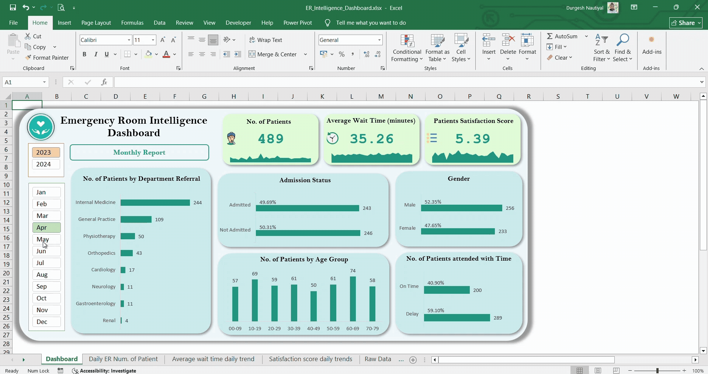
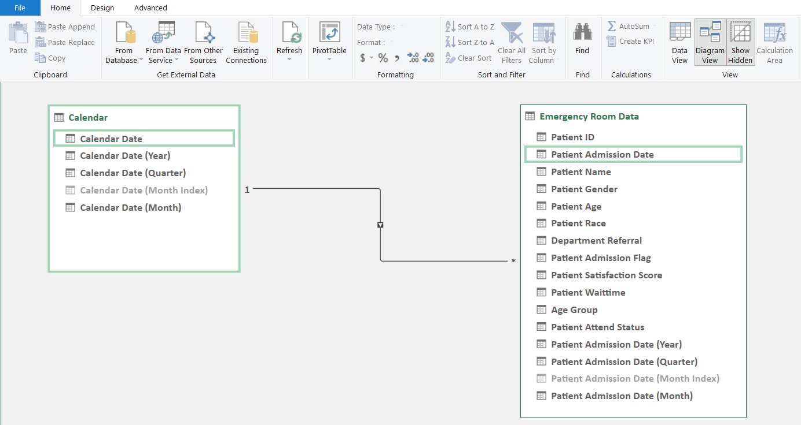

#  Emergency Room Intelligence Dashboard


An interactive **Excel dashboard** to analyze Emergency Room (ER) operations and support hospital decision-making using **Power Query**, **Power Pivot**, and **DAX**.

---

##  Project Purpose
To create a data-driven **Emergency Room Intelligence Dashboard** that improves patient management efficiency and delivers actionable insights for hospital stakeholders. The dashboard helps analyze ER performance metrics, detect bottlenecks, and track service quality over time.

---

##  Tools & Technologies
-  Microsoft Excel (with Power Query & Power Pivot)
-  Pivot Tables & Pivot Charts
-  DAX (Data Analysis Expressions)
-  Calendar Table for time intelligence
-  Custom Healthcare-themed Color Palette

---

##  Key KPIs
| KPI | Description |
|-----|-------------|
| **Number of Patients** | Total patients per day to spot peak activity |
| **Average Wait Time** | Average daily patient wait time; highlights operational delays |
| **Patient Satisfaction Score** | Tracks daily average satisfaction to monitor service quality |

---

##  Additional Visuals
- Patient Admission Status (Admitted vs Not Admitted)
- Patient Age Distribution (10-year age bands)
- Timeliness (seen within 30 mins)
- Gender Analysis (Male vs Female)
- Department Referrals (Top referred departments)

---

##  Data Model
**Tables:**
- `Calendar`: Dynamic date table (generated with Power Query)
- `Emergency Room Data`: Main patient data (Patient ID, Date, Department, etc.)

**Relationship:**
- `Calendar[Date]` → `Emergency Room Data[Patient Admission Date]`

---

##  DAX Calculated Columns

###  Age Group
```dax
= FORMAT(
    INT('Emergency Room Data'[Patient Age] / 10) * 10,
    "00"
    )
& "-" &
FORMAT(
    INT('Emergency Room Data'[Patient Age] / 10) * 10 + 9,
    "00"
)
```
Groups patient age into 10-year intervals (e.g., 20–29, 30–39).

###  Patient Attend Status
```dax
= IF('Emergency Room Data'[Patient Waittime] > 30, "Delay", "On Time")
```
Categorizes whether patients were attended to within 30 minutes.

---

##  Calendar Table (Power Query)
```powerquery
= List.Dates(#date(2023, 01, 01), 700, #duration(1, 0, 0, 0))
```

**Additional columns added:**
- Year, Month, Quarter, Week Number, Day Name, IsWeekend

---

##  Color Palette Used
| Purpose | Hex Code | Description |
|---------|----------|-------------|
| Background | `#f1f9ff` | Very light blue |
| Chart Base | `#ccecee` | Soft aqua |
| Primary Bars | `#14967f` | Teal green |
| Comparison Bars | `#14967f` | Teal green |
| Highlights  | `#e2fcd6` | Light green |

---

## 📸 Screenshots

###  Final Dashboard


###  Data Model View (Relationships)


###  Calendar Table (Power Query)


###  Applied Steps (Power Query)


###  DAX Calculated Columns


---


## 📂 Folder Structure
```
📁 emergency-room-intelligence-dashboard/
├── 📄 README.md
├── 📄 ER_Intelligence_Dashboard.xlsx
└── 📁 screenshots/
    ├── final_dashboard.png
    ├── data_model.png
    ├── calendar_table.png
    ├── power_query_steps.png
    ├── dax_measures.png
    └── video_thumbnail.png

```

---

##  Acknowledgments
Created by **Durgesh Nautiyal** as a portfolio project to demonstrate Excel-based reporting and healthcare analytics.

---

## 📬 Contact
📧 ram@example.com  
🔗 LinkedIn
